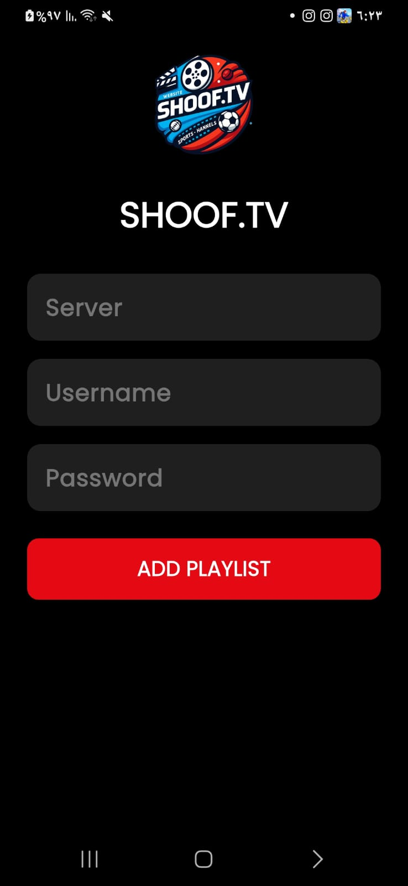

# 📺 Shoof IPTV

تطبيق Flutter لبث القنوات والأفلام والمسلسلات باستخدام Xtream Codes API.

## 🚀 الميزات

- تسجيل دخول باستخدام اسم مستخدم وكلمة مرور
- عرض القنوات المباشرة
- مشغل فيديو باستخدام VLC
- مشاهدة الأفلام والمسلسلات حسب التصنيفات
- إدارة الاشتراك ومعرفة نوع الاشتراك وتاريخ الانتهاء
- يدعم الوضع الليلي
- يعمل على Android وWindows

## 🖼️ صور من التطبيق

### تسجيل الدخول


### معلومات المستخدم 


### مشغل الافلام


### مشغل القناة


##  قائمة القنوات


## ⚙️ تقنية المستخدم

- Flutter
- Riverpod
- VLC Player
- Flutter Secure Storage
- Xtream Codes API

## 📦 تثبيت وتشغيل

```bash
flutter pub get
flutter run
